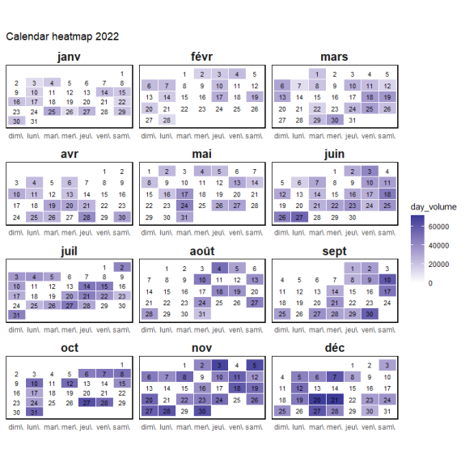

# Shiny Gym App 

## Overview

Testing url: [Testing](https://randomanass.shinyapps.io/Shiny_App/)

This is a Shiny web application to track workouts, visualize progress, and plan training routines. It provides features for calendar-based tracking, progress analysis, and exercise selection.

## Current App:

|   |    |  |
|---------------|---------------|---------------|
|  |  |  |
| |  |  | 

## Initial Screen shots

| Year Volume | Year Volume 2 | Progression |
|-------------|---------------|-------------|
|  |  |  |

| Full Progress | Exercises of the Day |
|---------------|-----------------------|
|  |  |

## Features

- **Calendar View:** Track your workouts and view them in a calendar format. Choose between yearly and monthly views to visualize your training history.

- **Progress monitoring:** Analyze your progress for specific exercises. Select exercises of interest and view their volume progress over time with interactive graphs.

- **Training of the Day:** Plan your daily workouts by selecting the date and viewing the exercises you've scheduled for that day.
  
- **Waterfall Plot:** Visualize the progression of exercise volume with an interactive waterfall plot.

- **Analytics:** **[TODO]**  Analyze workout data to gain insights into performance and areas of improvement.

## Installation
1. Clone the repository: `https://github.com/RandomAnass/Shiny_App.git`
2. Install the required dependencies: 
   - Run: `requirements.R`
3. Run the app: **[TODO]**

----------------------

